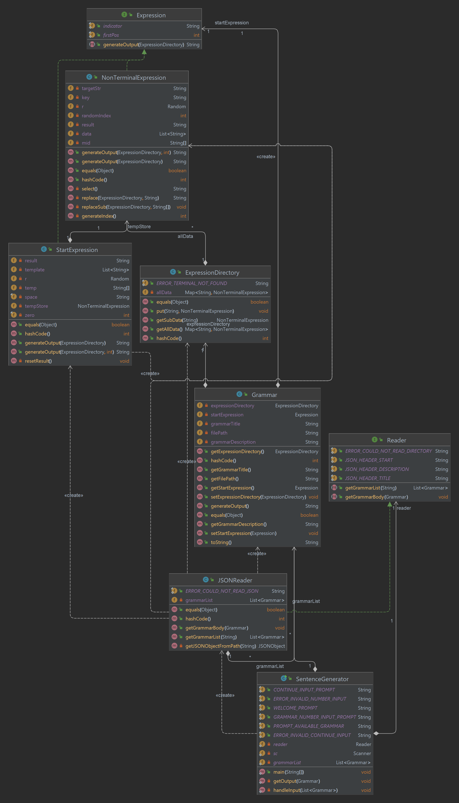

# Assignment 4

Author: Cody Cao and Letian Shi

Sourcing directories are based on IntelliJ IDE so please run the program on IntelliJ IDE otherwise it may not read the files.

Our main method is stored in class SentenceGenerator. You can run it through IntelliJ IDE with configuration:
grammars
And you should be able to run it. This specifies your directory of JSON files. We put "grammars" folder under "resources" directory. 

For testing the correctness. We set a random seed of 100 to them and to see whether each time we have the same output as well as whether they are correct according to the grammar rules determined in JSON files. We used the simple examle from instruction as our test case by manually enter the grammar and non-terminal data. You can see it in our NonTerminalExpression and StartExpression tests.
To set the random seed, we creeate new constructors and methods for NonTerminalExpression and StartExpression class with an additional input that holds the random seed and create the objects witht the same random seed in test class. Since we want random output when we actually use it, the new constructor with additional input would only be used here. 

## Project design
## Project structure:
### 1. Main method to handle command line args and user input (Cody)
	SentenceGenerator (main class) - handles user input

### 2. Reading Json (Cody)
	Read the Json (JSONReader)
	Parse every non-terminal expression within JSON into NonTerminalExpression objects with a list of words of that expression
	Add the objects to the ExpressionDirectory
	Generate a list of Grammar objects that were read from the directory
	
### 3. Grammar Class (Cody)
	Consists of a StartExpression object and an ExpressionDirectory object
	
### 4. Generating output (Letian)
*	Expression Interface (generateOutput()) with two implementation classes:
		   - NonTerminalExpression (adj, verb, etc.) - has a randomized method to choose a word to fill in, recursively call a non-terminal object to create a randomized string (use the ExpressionDirectory class) 
			A constructor (String, an ArrayList<String>)
			An ExpressionDirectory object 
		   - StartExpression - call non-terminal objects to create a randomized string -> a Constructor that accepts a String(template)
		
* ExpressionDirectory
		a TreeMap that have key-value pair <String, NonTerminalExpression> 
		Implement the put(String, NonTerminalExpression) method
		Implement the get(String) method
## UML 

