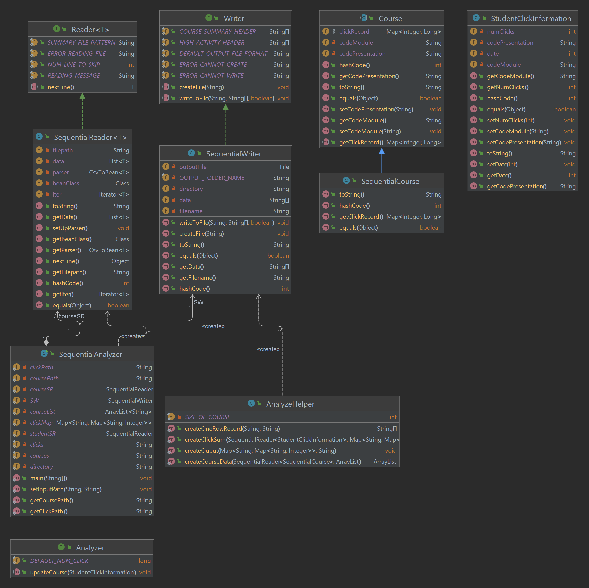

# Assignment 5

## Author: Cody Cao and Letian Shi

To run this project: 
1. Clone the project to your machine
2. Copy the StudentVle.csv file into assignment 5 folder (we did not upload it to GitHub due to its size)
3. Run doAll task in build.gradle for JavaDoc and test coverages.
4. To run main class:
   - For part 1: Go to Sequential package, run the SequentialAnalyzer class
   - For part 2 and 3: Go to Concurrent package, run the ConcurrentMain class. Pass the threshold value to CLI using IntelliJ for part 3 to run. If you don't fill in the value, the program will only run code for part 2.

## UML
### Part 1

### Part 2 and 3
