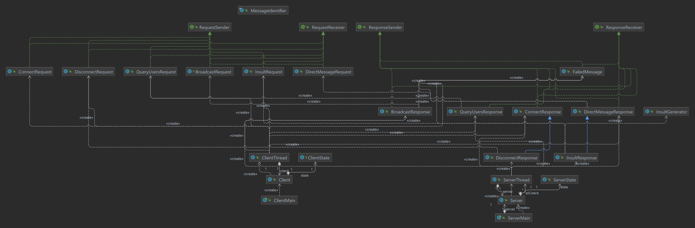

# Assignment 6

## Author: Cody Cao and Letian Shi

### To run this project:

1. Open project using IntelliJ
2. There are two pre-configured run tasks: ClientMain and ServerMain
3. Start the server first - run ServerMain class
4. Read output from the server to determine which port it's running on
5. Clients can be started as many as you want to. However, the server will only accept connections
   from up to 10 clients at the same time
    1. Run ClientMain task
    2. For host - input "localhost" or "127.0.0.1"
    3. For port - input the port number the server displayed when it started
    4. Input username
    5. Wait for connection response from the server and start using

### UML

### Key classes and methods

- **Server** class: Starts a server socket, and store information about connected clients
- **Client** class: Starts a communication socket to the server, listen to user's command
- **ServerThread** class: On server side, each ServerThread object handles communication between the
  server and a client
- **RequestSender** and **RequestReceiver** interfaces: Used to handle request from client to
  server.
    - **RequestSender** creates and send request through socket to server
    - **RequestReceiver** is used by server to read request from socket
- **ResponseSender** and **ResponseReceiver** interfaces: Used to handle response from server back
  to client
    - **ResponseSender** creates and send response through socket to client
    - **ResponseReceiver** is used by the client to read response from socket, and has a side effect
      of updating client's UI

### Assumptions

- We assumed that just like nowadays chat apps, you can send a message to yourself, so we do not
  prevent that
- We also assumed that an insult message is somewhat similar to a direct message, with the message's
  body being generated by the server, so we used inheritance for Insult
- When you force close a Client thread without using logoff, we will remove your username from the
  server's list of connected username, but a message will be printed on the server's console stating
  that the client did not disconnect properly
- We also do not allow multiple users of the same username to connect to the chatroom. We assume
  that it means the same user is trying to start multiple connections and will reject that.

### Correctness insurance

- When the connection is rejected, the ClientMain will stop execution, close the socket, and you
  will need to run the task again to connect - this helps prevent an unauthorized client to send
  messages
- The Client's UI has a method to check for grammar errors before sending the message to ensure that
  the request contracts is followed
- To maintain requests and response's contract, we used interface and classes that would have
  different methods available based on whether it's used by the server or the client
- User input is handled by a separated thread to prevent blocking